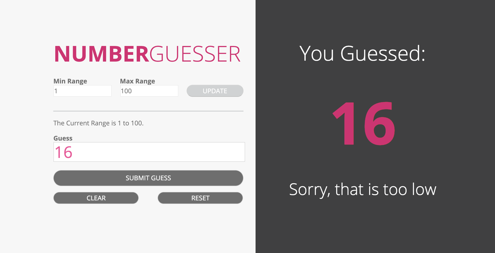
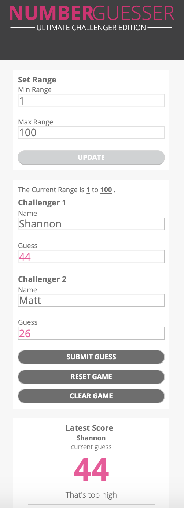

# Number Guesser Project
## Matthew Foxwell and Shannon Moranetz

Javascript, HTML, and CSS were used to create the Number Guesser Doubles project. In this app, a random number is selected and two players compete to try and guess the random number first. The game currently contains functionality for:

- Submitting guesses 
- Checking guesses against a randomly created number value
- Resetting the game 
- Clearing input fields
- Setting bounds for a minimum and maximum range
- Displaying stats regarding to the previous game played

### Week One Photo

### Week Two Photo

<!-- [!] [Week One Photo] (images/screen2.png) -->

### Original Comp

### Mobile View Photo

### Mobile View Comp

